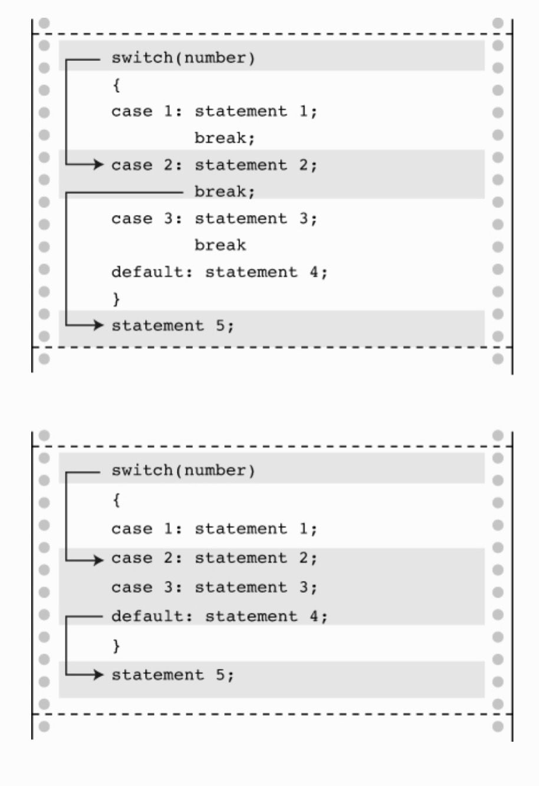

# ch07

## en zh_cn

- utility 实用的
- encountering 遭遇

## 科普

### if

```bash

if (expression)
      statement
```

```bash
if (expression)
    statement1
else
    statement2
```

```bash
if (expression)
    statement1
else if (expression2)
     statement2
else
     statement3

```

### getchar() putchar()

```bash

ch = getchar(); => scanf("%c", &ch);
putchar(ch); => printf("%c", ch);
```

### Character-Testing Functions 类型方法

- isalnum() 是否是数字
- isalpha() 是否是字母
- ....

### Character-Mapping Functions 转化方法

- tolower() 转为小写
- toupper() 转为大写

### Logical 逻辑运算符

- && 与
- || 或
- ! 非

### The Conditional Operator  `?:`

```bash

x = (y < 0) ? -y : y;

等同于

if (y < 0)
    x = -y;
else
    x = y;

```

### continue 与 break

```bash
# continue
When encountered , it causes the rest of an iteration to be skipped and the next iteration to be started.

# break
cause the loop to quit when

```

### switch 与 break

```bash
switch (integer expression)
{
     case constant1:
              statements    <--optional
     case constant2:
              statements    <--optional
     default :              <--optional
              statements    <--optional
}

```


